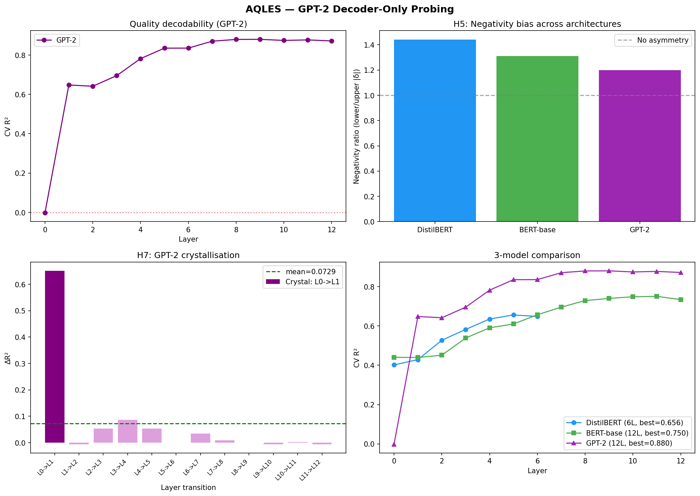

# AQLES - Probing Transformer Hidden States for Quality Geometry

[](https://colab.research.google.com/github/fabthebest/aqles/blob/main/notebook.ipynb)
[](LICENSE)
[](https://huggingface.co/datasets/fabthebest/aqles-quality-lexicon)
[](https://huggingface.co/spaces/fabthebest/aqles)

I got curious about whether BERT actually *knows* the difference between *adequate* and *masterful* not as a downstream classification task, but in its internal geometry. Most sentiment probing work collapses everything to positive/negative. I wanted to look at graded quality along a full scale.

So I built a controlled probing setup: 200 quality-annotated words across five tiers, embedded in standardized sentence templates, with GroupKFold that holds out entire words during testing (not just sentences — that distinction matters a lot). Three models, every layer, linear probes only.

The setup confirmed the basic hypothesis: quality is decodable. But two patterns showed up that I hadn't gone looking for.

---

## The findings

**Negative quality is encoded more sharply than positive quality.** Words like *terrible* and *abysmal* are geometrically more separable than *stellar* and *pristine*  at every layer, across all three models. The ratio is 1.44× on DistilBERT, 1.31× on BERT-base, 1.20× on GPT-2. This mirrors the human negativity bias (Baumeister et al., 2001), but I want to be careful about that claim: it could equally reflect that negative quality words appear in more constrained, predictable contexts in the training corpus. I'm running corpus-level analysis to try to distinguish these. The short version: the asymmetry is real and robust, the explanation is still open.

**GPT-2 surprised me.** I expected encoder models to dominate, they see full bidirectional context, they're explicitly trained to build rich token representations. GPT-2 outperformed both: R² = 0.880 vs. 0.750 for BERT-base, 88.5% five-tier accuracy. More importantly, GPT-2 shows essentially no frequency-error correlation (ρ = 0.027, p = 0.71), while BERT and DistilBERT are significantly affected by word rarity. Rare evaluative words like *irreproachable* are poorly encoded by the encoders, but GPT-2 handles them as well as common ones. Something about autoregressive training seems to produce more generalizable quality representations. I don't fully understand why yet.

**Quality crystallises early rather than accumulating gradually.** In all three models, decodability jumps at a specific layer rather than increasing smoothly. On GPT-2 the L0→L1 transition is 8.9× the average inter-layer gain. On BERT-base, L2→L3 is 3.6×. After that jump, gains flatten. One nuance worth noting: while *decodability* (CV R²) shows this phase transition, the quality signal doesn't come to dominate the representation geometry silhouette scores and PC1 alignment stay low. High probing accuracy doesn't mean quality is a primary organising axis; it just means the signal is linearly accessible.

| Metric | DistilBERT | BERT-base | GPT-2 |
|---|---|---|---|
| Best CV R² | 0.656 (L5) | 0.750 (L11) | **0.880 (L9)** |
| Best CV Accuracy | 79.3% | 83.5% | **88.5%** |
| Negativity ratio | 1.44× | 1.31× | 1.20× |
| Crystallisation | L1→L2 (2.4×) | L2→L3 (3.6×) | L0→L1 (8.9×) |
| Freq-error ρ | 0.332*** | 0.190** | 0.027 (n.s.) |
| Multi-seed variance | 0.0000 | 0.0000 | 0.0000 |

All CV metrics use GroupKFold on held-out *words* not just held-out sentences. The probe never sees any template of a test word during training.

Non-contextual baselines (TF-IDF, BoW): 20% accuracy, R² ≈ 0. The quality signal is built during the forward pass, not recoverable from surface features.



---

## How the probing works

**Lexicon.** 200 English words distributed evenly across five quality tiers (40 each): Terrible (<0.15), Mediocre (0.15–0.44), Good (0.45–0.77), Excellent (0.78–0.89), Exceptional (≥0.90). Scores calibrated against the NRC Valence-Arousal-Dominance lexicon.

**Sentences.** Each word goes into 10 sentence templates (5 neutral framing, 5 institutional/peer-review framing), always in predicative adjectival position: *"The overall quality of this work is {word}."* This gives 2,000 probing sentences. A variance decomposition confirmed that template identity contributes 0.002% of variance; word identity accounts for 98.4%.

**Probing.** Mean-pooled hidden states from every layer, z-scored per feature. Ridge regression (continuous quality score, α selected per layer via GroupKFold) and logistic regression (five-tier classification, C=1.0). GroupKFold with word_id as grouping key all 10 templates of a word always go to the same fold.

The word-level grouping is the design choice that matters most. If you put different templates of the same word in train and test, you're measuring template generalisation, not quality encoding.

---

## Try it

**Live demo:** [huggingface.co/spaces/fabthebest/aqles](https://huggingface.co/spaces/fabthebest/aqles)  type any English word, pick a model, see predicted quality at every layer and 3D geometry of the tier clusters.

**Reproduce everything:**
```bash
git clone https://github.com/fabthebest/aqles.git
```
Or use the Colab badge above. Runtime on T4: ~45 min for all three models.

**Run the demo locally:**
```bash
pip install gradio transformers torch scikit-learn plotly
python app.py
```

---

## Hypotheses

| # | Question | Result |
|---|---|---|
| H1 | Does quality decoding improve monotonically with depth? | ✅ Kendall τ = 0.77–0.91, p < 0.001 |
| H2 | Does accuracy exceed chance at every layer? | ✅ |
| H3 | Are quality tiers geometrically separable? | ✅ 9/10 tier pairs large effect size (Cliff's δ > 0.474). Exception: Excellent vs. Exceptional |
| H4 | Does quality unfold quasi-unidimensionally? | ✅ PC1 explains 96.7–97.2% of trajectory variance |
| H5 | Are negative tiers more separable than positive? | ✅ 1.20–1.44× across all models and layers |
| H6 | Do rare words probe worse? | ✅ encoders (ρ = 0.19–0.33), ✗ GPT-2 (ρ = 0.027) |
| H7 | Is there a crystallisation layer? | ✅ jump of 2.4–8.9× at ~25–30% depth |

---

## What I'm working on now

The most urgent question is whether the negativity asymmetry is a property of language or of models. If negative quality words have lower distributional diversity in Wikipedia/BooksCorpus if *abysmal* appears in more constrained and predictable contexts than *stellar*  then BERT is reflecting that structure, not creating it. Corpus-level analysis is in progress (CPU-only, no GPU needed).

After that: activation patching to identify the specific attention heads responsible for the quality signal at the crystallisation layer. TransformerLens makes this feasible on DistilBERT without heavy compute.

Longer term: cross-lingual replication (does the same negativity asymmetry appear in French and Mandarin?), and scale testing on Llama-3.

---

## Looking for collaborators

A few specific things I can't do alone:

**Cross-lingual lexicon construction.** I need help building equivalent 5-tier quality lexicons in Mandarin Chinese and French, same structure, 40 words per tier. If you're a native speaker with some NLP familiarity and this sounds interesting, open an issue or reach out directly.

**Scale testing.** Running AQLES on Llama-3-8B or Mistral-7B requires more than free Colab. If you have A100 access and want to collaborate, let's talk.

**Activation patching / mechanistic interpretability.** If you know TransformerLens and find the crystallisation result interesting, I'd welcome a collaboration on the causal follow-up.

I'm an independent researcher , no institutional affiliation, no lab. I'm looking for collaborators who find the questions interesting, not co-authors to fill out a roster.

---

## Limitations (honest version)

200 words is a proof of concept. The lexicon is English-only and reflects Western academic quality norms. Probing measures correlation, not causation, I can't tell you *how* the model builds the quality signal, only that it's there and linearly accessible. The WordPiece subtoken count is a crude frequency proxy. The Excellent/Exceptional pair (Tier 3/4) remains geometrically inseparable across all models (Cliff's δ = 0.10), suggesting a ceiling on fine-grained positive discrimination that I don't have a good explanation for.

---

## References

Alain & Bengio (2017). Understanding intermediate layers using linear classifier probes. *ICLR Workshop.*
Baumeister et al. (2001). Bad is stronger than good. *Review of General Psychology.*
Belinkov (2022). Probing classifiers: Promises, shortcomings, and advances. *Computational Linguistics.*
Cliff (1993). Dominance statistics. *Psychological Bulletin.*
Conneau et al. (2018). What you can cram into a single $&!#* vector: Probing sentence embeddings for linguistic properties. *ACL.*
Devlin et al. (2019). BERT. *NAACL.*
Hewitt & Manning (2019). A structural probe for finding syntax in word representations. *NAACL.*
Mohammad (2018). Obtaining reliable human ratings of valence, arousal, and dominance. *ACL.*
Olsson et al. (2022). In-context learning and induction heads. *Transformer Circuits Thread.*
Pedregosa et al. (2011). Scikit-learn. *JMLR.*
Radford et al. (2019). Language models are unsupervised multitask learners. *OpenAI Blog, 1(8).*
Rozin & Royzman (2001). Negativity bias, negativity dominance, and contagion. *PSPR.*
Sanh et al. (2019). DistilBERT. *arXiv.*
Tenney, Das & Pavlick (2019). BERT rediscovers the classical NLP pipeline. *ACL.*
Warriner, Kuperman & Brysbaert (2013). Norms of valence, arousal, and dominance for 13,915 English lemmas. *Behavior Research Methods.*
Wolf et al. (2020). Transformers: State-of-the-art NLP. *EMNLP.*

---

## Citation

```bibtex
@misc{filsaime2026aqles,
  author = {Fils-Aimé, Fabrice},
  title  = {{AQLES}: Probing Transformer Hidden States to Decode Quality Ranking Geometry},
  year   = {2026},
  url    = {https://github.com/fabthebest/aqles}
}
```

Apache 2.0

---

Fabrice Fils-Aimé · [github.com/fabthebest](https://github.com/fabthebest)
