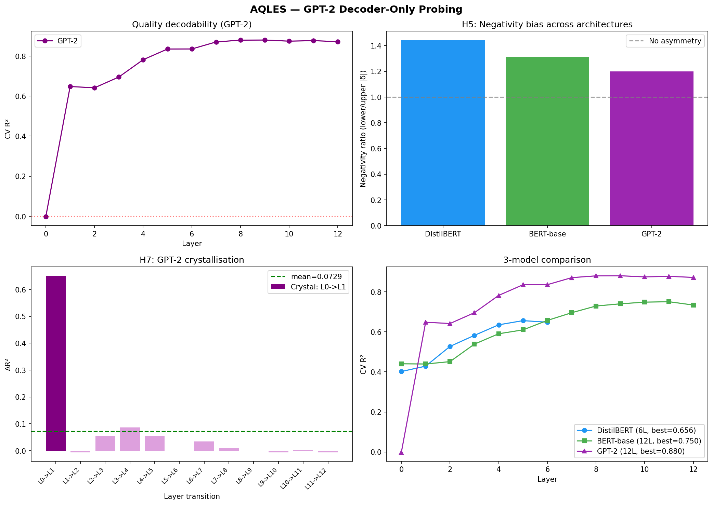

# AQLES - Probing Transformer Hidden States for Quality Geometry

[](https://colab.research.google.com/github/fabthebest/aqles/blob/main/notebook.ipynb)
[](LICENSE)
[](https://huggingface.co/datasets/fabthebest/aqles-quality-lexicon)
[](https://huggingface.co/spaces/fabthebest/aqles)

I got curious about whether BERT actually knows the difference between *adequate* and *masterful*, not as a downstream classification task, but in its internal geometry. Most sentiment probing work collapses everything to positive/negative. I wanted to look at graded quality along a full scale.

So I built a controlled probing setup: 200 quality-annotated words across five tiers, embedded in standardized sentence templates, with GroupKFold that holds out entire words during testing (not just sentences; that distinction matters a lot). Three models, every layer, linear probes only.

The setup confirmed the basic hypothesis: quality is decodable. But two patterns showed up that I had not gone looking for.

---

## Findings

**Negative quality is encoded more sharply than positive quality.** Words like *terrible* and *abysmal* are geometrically more separable than *stellar* and *pristine* at every layer, across all three models. The ratio is 1.44x on DistilBERT, 1.31x on BERT-base, 1.20x on GPT-2. This mirrors the human negativity bias (Baumeister et al., 2001), but I want to be careful about that claim: a TF-IDF analysis of Wikipedia contexts found no distributional basis for the asymmetry (rho = -0.03, p = 0.69). The short version: the asymmetry is real and robust. The explanation is still open.

**GPT-2 surprised me.** I expected encoder models to dominate. They see full bidirectional context and are explicitly trained to build rich token representations. GPT-2 outperformed both: R-squared = 0.880 vs. 0.750 for BERT-base, 88.5% five-tier accuracy. More importantly, GPT-2 shows essentially no frequency-error correlation (rho = 0.027, p = 0.71), while BERT and DistilBERT are significantly affected by word rarity. Rare evaluative words like *irreproachable* are poorly encoded by the encoders, but GPT-2 handles them as well as common ones. Something about autoregressive training seems to produce more generalizable quality representations. I do not fully understand why yet.

**Quality crystallises early rather than accumulating gradually.** In all three models, decodability jumps at a specific layer rather than increasing smoothly. On GPT-2 the L0-to-L1 transition is 8.9x the average inter-layer gain. On BERT-base, L2-to-L3 is 3.6x. After that jump, gains flatten. One nuance worth noting: while decodability (CV R-squared) shows this phase transition, the quality signal does not come to dominate the representation geometry. Silhouette scores and PC1 alignment stay low. High probing accuracy does not mean quality is a primary organising axis; it just means the signal is linearly accessible.

| Metric | DistilBERT | BERT-base | GPT-2 |
|---|---|---|---|
| Best CV R-squared | 0.656 (L5) | 0.750 (L11) | **0.880 (L9)** |
| Best CV Accuracy | 79.3% | 83.5% | **88.5%** |
| Negativity ratio | 1.44x | 1.31x | 1.20x |
| Crystallisation | L1-L2 (2.4x) | L2-L3 (3.6x) | L0-L1 (8.9x) |
| Freq-error rho | 0.332*** | 0.190** | 0.027 (n.s.) |
| Multi-seed variance | 0.0000 | 0.0000 | 0.0000 |

All CV metrics use GroupKFold on held-out words, not just held-out sentences. The probe never sees any template of a test word during training.

Non-contextual baselines (TF-IDF, BoW): 20% accuracy, R-squared near 0. The quality signal is built during the forward pass, not recoverable from surface features.



---

## How the probing works

**Lexicon.** 200 English words distributed evenly across five quality tiers (40 each): Terrible (below 0.15), Mediocre (0.15 to 0.44), Good (0.45 to 0.77), Excellent (0.78 to 0.89), Exceptional (0.90 and above). Scores calibrated against the NRC Valence-Arousal-Dominance lexicon (Mohammad, 2018).

**Sentences.** Each word goes into 10 sentence templates (5 neutral framing, 5 institutional/peer-review framing), always in predicative adjectival position: *"The overall quality of this work is {word}."* This gives 2,000 probing sentences. A variance decomposition confirmed that template identity contributes 0.002% of variance; word identity accounts for 98.4%.

**Probing.** Mean-pooled hidden states from every layer, z-scored per feature. Ridge regression (continuous quality score, alpha selected per layer via GroupKFold) and logistic regression (five-tier classification, C=1.0). GroupKFold with word_id as grouping key: all 10 templates of a word always go to the same fold.

The word-level grouping is the design choice that matters most. If you put different templates of the same word in train and test, you are measuring template generalisation, not quality encoding.

---

## Try it

**Live demo:** [huggingface.co/spaces/fabthebest/aqles](https://huggingface.co/spaces/fabthebest/aqles) - type any English word, pick a model, see predicted quality at every layer and 3D geometry of the tier clusters.

**Reproduce everything:**
```bash
git clone https://github.com/fabthebest/aqles.git
Or use the Colab badge above. Runtime on T4: about 45 min for all three models.

Run the demo locally:

bash
pip install gradio transformers torch scikit-learn plotly
python app.py
Experiments across six rounds
The project grew from a single probing experiment into six rounds of investigation across 10+ models and 3 languages. The technical report covers each round in detail.

Version	Exp	Finding	Status
V1	H1-H7	Quality decodable (R-squared=0.88). Negativity bias 1.44x. Crystallisation at 25-30% depth.	Replicated on 3 models
V2	A	Distributional hypothesis rejected: negative words do NOT appear in more constrained Wikipedia contexts (rho=-0.03, p=0.69)	Null result
V2	B	Negativity bias first appears at training step 512 (ratio=1.89x), peaks at step 1000, then diminishes to 1.41x	Confirmed
V2	C	Bias decreases with scale: Pythia 70M 1.41x, 410M 1.13x, 1.4B 1.09x. R-squared improves from 0.66 to 0.95	Confirmed
V3	D	Peak at step 1000 is universal: same relative training step (0.7%) on both 70M and 410M	Confirmed on 2 models
V3	E	Bias localised in 5 attention heads (80.3% of asymmetry signal on 70M). Distributed on 410M (22.5%)	Partial
V3	F	Temporal head formation: "balancing heads" (0.23x) and "asymmetry heads" (2.42x) emerge and counterbalance	Novel finding
V4	H	Perturbation stability predicts probe error (rho=-0.20, p<0.005 on all 3 models). Rarity leads to instability leads to error.	Confirmed on 3 models
V4	I	T0 more stable than T4 on DistilBERT/BERT (p<0.001). Tier-independent on Pythia-70M.	Model-dependent
V5	K	BERT-cased loses 58% accuracy when inputs are uppercased	Robustness failure
V5	M	Default quality prior = T2 (Good) for neutral and invented words	Confirmed on BERT
V6	N	Cross-lingual negativity bias on XLM-RoBERTa: EN 1.2x, FR 2.0x, ES 3.3x	Suggestive
V6	O	Probe error not predictable from surface features (RF R-squared=0.04)	Null result
V6	P	Cross-lingual phrase prediction: 5/6 correct (83%) with calibrated confidence	Confirmed
V6	Q	Phi-3-mini (RLHF model): R-squared=0.926, bias persists at 1.24x, crystallisation at 6% depth	Best score in project
Concurrently with this work, Sofroniew, Kauvar et al. (2026) at Anthropic identified emotion concept representations in Claude Sonnet 4.5 with causally validated steering effects. Their geometry (valence/arousal as PC1/PC2) parallels ours (PC1 captures 96.7% of trajectory variance in our setup). Our work focuses on complementary questions: training dynamics, cross-lingual universality, and scaling behavior of evaluative representations in open-source models.

Hypotheses (V1)
#	Question	Result
H1	Does quality decoding improve monotonically with depth?	Kendall tau = 0.77 to 0.91, p < 0.001
H2	Does accuracy exceed chance at every layer?	Yes
H3	Are quality tiers geometrically separable?	9/10 tier pairs large effect size. Exception: Excellent vs. Exceptional
H4	Does quality unfold quasi-unidimensionally?	PC1 explains 96.7 to 97.2% of trajectory variance
H5	Are negative tiers more separable than positive?	1.20 to 1.44x across all models and layers
H6	Do rare words probe worse?	Encoders yes (rho = 0.19 to 0.33). GPT-2 no (rho = 0.027)
H7	Is there a crystallisation layer?	Jump of 2.4 to 8.9x at about 25 to 30% depth
What is still open
Activation patching to identify which attention heads cause the bias: the step from correlation to intervention that Anthropic's paper demonstrates for emotions but that remains undone for quality. Cross-lingual replication in Mandarin and Arabic. Scale testing on Llama-3. Neuron-level ablation to establish direct causal mechanisms.

Looking for collaborators
A few specific things I cannot do alone:

Cross-lingual lexicon construction. I need help building equivalent 5-tier quality lexicons in Mandarin Chinese and Arabic, same structure, 40 words per tier. If you are a native speaker with some NLP familiarity and this sounds interesting, open an issue or reach out directly.

Scale testing. Running AQLES on Llama-3-8B or Mistral-7B requires more than free Colab. If you have A100 access and want to collaborate, let us talk.

Activation patching / mechanistic interpretability. If you know TransformerLens and find the crystallisation result interesting, I would welcome a collaboration on the causal follow-up.

Affiliation and Disclaimer

The author is an independent researcher with no institutional affiliation.
This work was conducted independently and is not affiliated with,funded by, or endorsed by any organization, including Anthropic,
DeepSeek, OpenAI, or other AI companies.

The author welcomes collaboration based on shared intellectual interest rather than formal affiliation.

How this was built
I designed the experimental protocol, chose the methodology, and interpreted all results. The implementation uses standard tools (scikit-learn, HuggingFace Transformers). Claude and DeepSeek assisted with code generation and debugging. The research questions, experimental architecture, and analysis decisions are mine.

This project started as a question I could not find an answer to in the literature. It grew into six rounds of experiments conducted entirely on Google Colab free tier. No GPU cluster, no lab, no funding.

Limitations
200 words is a proof of concept. Probing measures correlation, not causation: I cannot tell you how the model builds the quality signal, only that it is there and linearly accessible. The WordPiece subtoken count is a crude frequency proxy; real corpus frequency (via wordfreq or similar) would be more rigorous. The Excellent/Exceptional pair (Tier 3/4) remains geometrically inseparable across all models (Cliff's delta = 0.10), suggesting a ceiling on fine-grained positive discrimination that I do not have a good explanation for. The H5 ratio could be partially inflated by unequal score dispersion across tiers: Tier 0 scores are concentrated between 0.01 and 0.05 while Tier 4 scores span 0.90 to 1.00, and a control with equalized within-tier variance has not been run.

The cross-lingual results (V6) extend beyond English to French and Spanish, but the lexicons for those languages are smaller (about 100 words each), were not independently validated by native-speaker linguists, and were constructed by a non-native speaker. The 3.3x ratio in Spanish could reflect a real cross-lingual effect or word selection bias. The 1.4B Pythia model failed in V3 due to a tokenizer bug (pad_token), limiting the mechanistic scaling claim to two model sizes. Some attention head extractions show zero variance on the 70M final checkpoint, meaning V3 head attribution is reliable only for layers 0-2.

References
Alain & Bengio (2017). Understanding intermediate layers using linear classifier probes. ICLR Workshop.
Baumeister et al. (2001). Bad is stronger than good. Review of General Psychology.
Belinkov (2022). Probing classifiers: Promises, shortcomings, and advances. Computational Linguistics.
Cliff (1993). Dominance statistics. Psychological Bulletin.
Conneau et al. (2018). What you can cram into a single $&!#* vector: Probing sentence embeddings for linguistic properties. ACL.
Devlin et al. (2019). BERT. NAACL.
Hewitt & Manning (2019). A structural probe for finding syntax in word representations. NAACL.
Mohammad (2018). Obtaining reliable human ratings of valence, arousal, and dominance. ACL.
Olsson et al. (2022). In-context learning and induction heads. Transformer Circuits Thread.
Pedregosa et al. (2011). Scikit-learn. JMLR.
Radford et al. (2019). Language models are unsupervised multitask learners. OpenAI Blog, 1(8).
Rozin & Royzman (2001). Negativity bias, negativity dominance, and contagion. PSPR.
Sanh et al. (2019). DistilBERT. arXiv.
Sofroniew, Kauvar et al. (2026). Emotion concepts and their function in a large language model. Transformer Circuits Thread.
Tenney, Das & Pavlick (2019). BERT rediscovers the classical NLP pipeline. ACL.
Tigges et al. (2023). Linear representations of sentiment in large language models. arXiv:2310.15154.
Warriner, Kuperman & Brysbaert (2013). Norms of valence, arousal, and dominance for 13,915 English lemmas. Behavior Research Methods.
Wolf et al. (2020). Transformers: State-of-the-art NLP. EMNLP.

Citation
bibtex
@misc{filsaime2026aqles,
  author = {Fils-Aim\'{e}, Fabrice},
  title  = {{AQLES}: Probing Transformer Hidden States to Decode Quality Ranking Geometry},
  year   = {2026},
  url    = {https://github.com/fabthebest/aqles}
}
Apache 2.0

Fabrice Fils-Aime - github.com/fabthebest
